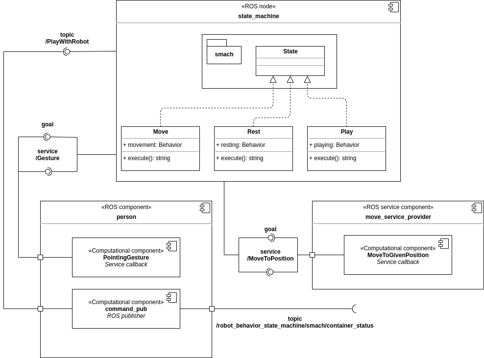

# EROLA_first_assignment_AG

October 24, 2020

Editors:

* Andrea Gotelli

This file aim to explain how to move inside this project. It should be read before starting to look around, it can give some insight on the elements and structure of the code.

## Index

* [Introduction](#S-Introduction)
* [Software Architecture](#SA-Sofar)
* [Launch File](#-Launch)
* [Working Hypothesis](#WH)

# Introduction
This project contains packages to simulate three behavior for a pet like robot. This simulation is based on a state machine that is implemented using the smach libraries.

# Software Architecture
The package is for simulating a pet like robot which has three Possible behaviors. It can move around randomly, it can interacting with the user, playing with they and it can also sleep when tired. The three states are governed using a finite state machine, which defines the transitions from one state to another. For the knowledge representation, two diagrams are implemented.

* [The State Machine Diagram](#SA-SMD)
* [The Component Diagram](#SA-CD)

## The State Machine Diagram
The following figure shows the state machine diagram for this implementation, as well as some knowledge about which interfaces each state has, with respect to the rest of the architecture.

The figure illustrates the three states for this application, beside some components. The aim is to provide insight on the states and transitions as well as the interfaces that all the states have.
In particular, all the states will be analyzed in the following.

* [The Move behavior](#SMD-MOVE)
* [The Rest behavior](#SMD-REST)
* [The Play behavior](#SMD-PLAY)

##### The Move behavior

The robot starts in the with in the Move state, where the robot moves randomly in the environment. While moving, the robot do not perform any other activity. For this reason the movement is implemented using a ROS service, in this way the state machine ignore any information received from the outside until the position is reached. This behavior will last until one of the following happens:
* The robot reaches the maximum level of fatigue : in this case the state will change to [Rest](#SMD-REST)  with the transition "tired"
* A person has commanded something : in this case the state will change to [Play](#SMD-PLAY) with the transition "playing"

##### The Rest behavior
The Rest behavior simulates the pet like robot when going to sleep. In fact, every movement that the robot perform increases the level of fatigue in the robot. Once the level of fatigue is above a threshold, the Rest behavior is activated. The transition "tired" is the same in both [Move](#SMD-MOVE) and [Play](#SMD-PLAY). Moreover, the threshold can be set from the launch file (see [Launch File](#S-Launch) ).

##### The Play behavior
When the robot is in the Play behavior, it waits for gesture from the person. This behavior will loop for a random number of times, between 1 to 4. When the robot receives a gesture it moves to the pointed location. As in the [Move](#SMD-MOVE) behavior, the movements are simulated calling the ROS service "/MoveTo".
Each time the robot moves, the level of fatigue increases. Once it reaches the maximum, the state will change into [Rest](#SMD-REST) with the transition "tired"

## The Component Diagram
The following figure shows the components and their relevant parts of this application. Additionally, it also includes a class diagram inside the state machine component. It is important to understand that all the behaviors are simulated through the execution of the memeber function execute() common to all classes.

The figure shows all the component with their interfaces. In the following, a brief description is given for all of them.

* [The move_service_provider component](#CD-msp)
* [The person component](#SMD-p)
* [The state_machine component](#SMD-sm)

##### The move_service_provider component
This component is a simple ROS service provider written in C++. It only contains the node initialization and the service server declaration. Its main component is the MoveToGivenPosition that is the service callback. This function is called each time a request is sent to the service. It simply wait for some time before returning true allowing the simulation to continue. The time that the function waits randomly change between 3 and 6 seconds.

##### The person component
The person component is a ROS node written in C++. It contains a publisher, a subscriber and a service provider. The subscrive is for retrieve the current state of the [state machine](#CD-sm). The publisher is for publishing the command to the pet like robot. The command is published only if: the state machine is in the [Move](#SMD-MOVE) state and it has passed a specific amount of time from the last call. This time elapsed varies randomly in an interval given by the user in the [Launch file](#S-Launch). Finally, the service provider has a callback function represented by the computational component: PointingGesture. This function simply simulate the person pointing a location first by generating a random 2D position, then by waiting some time, randomly chosen between 3 and 6 seconds.

##### The state_machine component
The state machine node is the heart of this simulation. It implements a state machine from the template of smach. The state machine offers three behaviors for the robot: [Move](#SMD-MOVE), [Play](#SMD-PLAY) and [Rest](#SMD-REST). Each behavior is implemented in the homonymous class. The class has only a constructor, where all the members are initialized and a member function execute(). In this last function the features for the corresponding behavior are implemented.  

The messages defined in this project are the following:
  * PersonCalling: is a message containing a string and a geometry_msgs Pose. It contains the command the person has given in the string and the position of the person in the geometry message.

Beside the message, this project makes use of two services:
  * GiveGesture: is the service message containing the request and the answer for the service providing the position where the person was pointing. It contains a boolean in the request, and a geometry_msgs Pose in the response. The boolean can be ignored when calling the service. It is used only because a service cannot be defined without at least one argument in the question. The response is the pointed location.
  * MoveTo: this is the service message used for the service simulating the robot movements. It contains the position the robot has to reach. it confirms the robot to have reached the position through the return of the callback, which is a boolean. IN other words, there is not a response field for this service.

# Working Hypothesis
The simulation is based on three nodes in python3 and C++. The state machine is implemented in python using the smach libraries. It simulates the three behaviors: Move, Play and Rest. The environment is a 2D space i.e. the robot moves on a plane. In the context of this simulation, the motion is simulated in a very abstract level; it consists of some time spent to reach a location.

3. Packages and file list (to navigate the repository based on 2)
4. Installation and running procedure
(including all the steps to display the robot’s behavior)
5. Working hypothesis and environment (1 or 2 paragraph)
6. System’s features (1 or 2 paragraph)
7. System’s limitations (1 or 2 paragraph)
8. Possible technical Improvements (1 or 2 paragraph)
9. Authors and contacts (at least the email)
