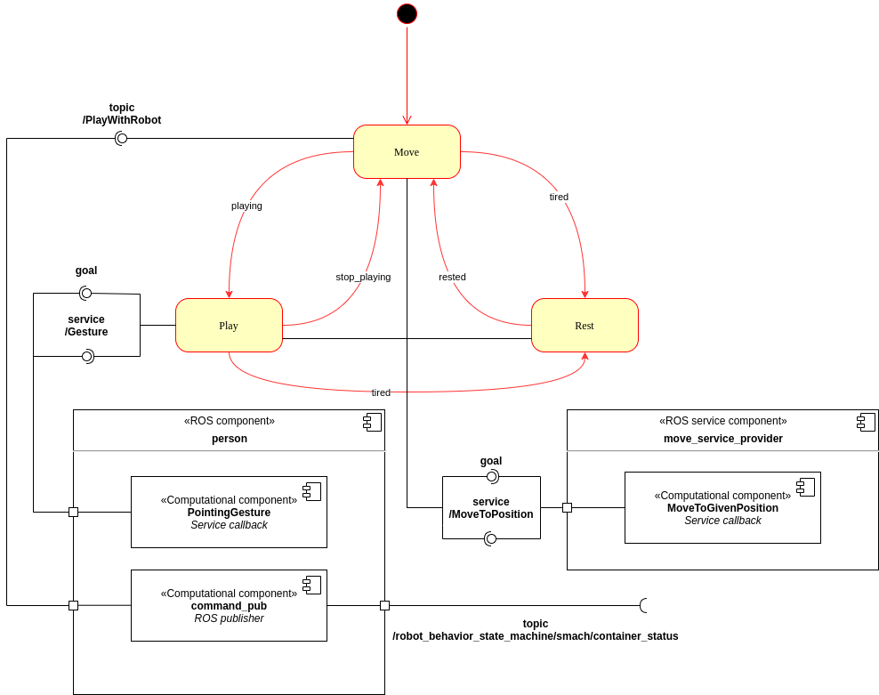
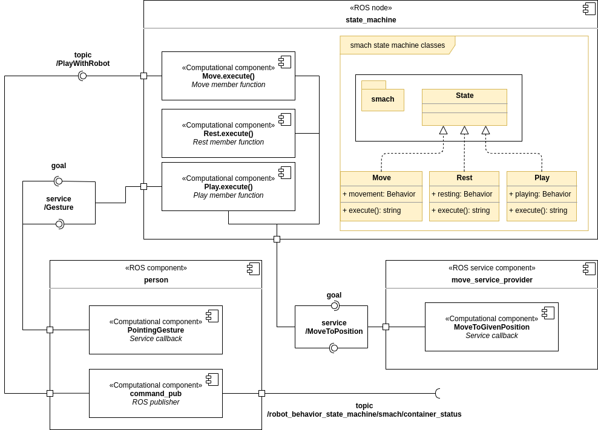
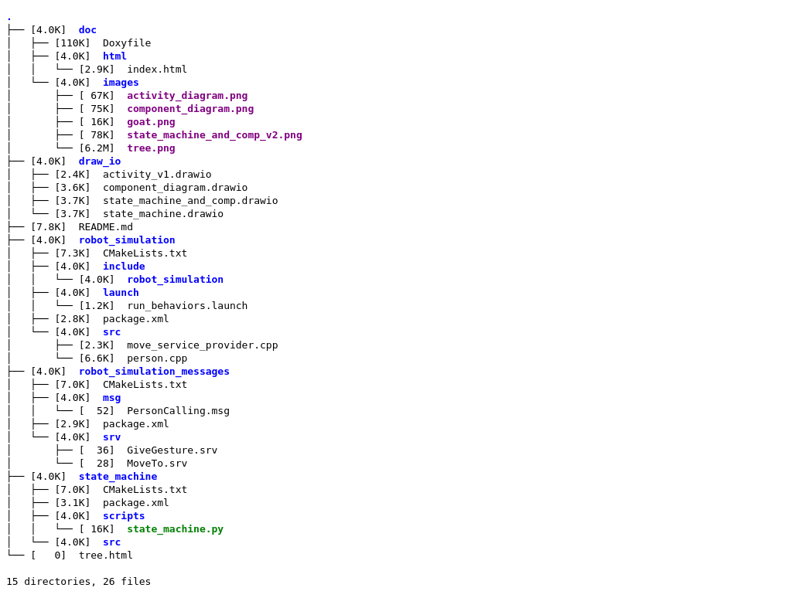

# EROLA_first_assignment_AG

October 24, 2020

Editors:

* Andrea Gotelli

This file aim to explain how to move inside this project. It should be read before starting to look around, it can give some insight on the elements and structure of the code.

## Index

* [Introduction](#S-Introduction)
* [Software Architecture](#S-Sofar)
* [Packages and Files List](#S-PFL)
* [Installation and Running Procedure](#S-IRP)
* [Working Hypothesis](#S-WH)
* [System’s Features](#S-SF)
* [System’s Limitations](#S-SL)
* [Possible Technical Improvements](#S-PTI)
* [Authors and Contacts](#S-AC)

# Introduction
This project contains packages to simulate three behavior for a pet like robot. This simulation is based on a state machine that is implemented using the smach libraries.

# Software Architecture
The package is for simulating a pet like robot which has three possible behaviors. It can move around randomly, it can interact by playing with the user and it can also sleep when tired. The three states are governed using a finite state machine, which defines the transitions from one state to another. For the knowledge representation, two diagrams are implemented.

* [The State Machine Diagram](#SA-SMD)
* [The Component Diagram](#SA-CD)

## The State Machine Diagram
The following figure shows the state machine diagram for this implementation, as well as some knowledge about which interfaces each state has, with respect to the rest of the architecture.

The figure illustrates the three states for this application, beside some components. The aim is to provide insight on the states and transitions as well as the interfaces that all the states have.
In particular, all the states will be analyzed in the following.

* [The Move behavior](#SMD-MOVE)
* [The Rest behavior](#SMD-REST)
* [The Play behavior](#SMD-PLAY)

##### The Move behavior

The robot starts in the in the Move state, where the robot moves randomly in the environment. While moving, the robot do not perform any other activity. For this reason the movement is implemented using a ROS service, in this way the state machine ignore any information received from the outside until the position is reached. This behavior will last until one of the following happens:
* The robot reaches the maximum level of fatigue : in this case the state will change to [Rest](#SMD-REST)  with the transition "tired"
* A person has commanded something : in this case the state will change to [Play](#SMD-PLAY) with the transition "playing"

##### The Rest behavior
The Rest behavior simulates the pet like robot when going to sleep. In fact, every movement that the robot perform increases the level of fatigue in the robot. Once the level of fatigue is above a threshold, the Rest behavior is activated. The transition "tired" is the same in both [Move](#SMD-MOVE) and [Play](#SMD-PLAY). Moreover, the threshold can be set from the launch file.

##### The Play behavior
When the robot is in the Play behavior, it waits for gesture from the person. This behavior will loop for a random number of times, between 1 to 4. When the robot receives a gesture it moves to the pointed location. As in the [Move](#SMD-MOVE) behavior, the movements are simulated calling the dedicated ROS service.
Each time the robot moves, the level of fatigue increases. Once it reaches the maximum, the state will change into [Rest](#SMD-REST) with the transition "tired"

## The Component Diagram
The following figure shows the components and their relevant parts of this application. Additionally, it also includes a class diagram inside the state machine component. It is important to understand that all the behaviors are simulated through the execution of the memeber function execute() common to all classes.

The figure shows all the component with their interfaces. In the following, a brief description is given for all of them.

* [The move_service_provider component](#CD-msp)
* [The person component](#SMD-p)
* [The state_machine component](#SMD-sm)

##### The move_service_provider component
This component is a simple ROS service provider written in C++. It only contains the node initialization and the service server declaration. Its main component is the MoveToGivenPosition that is the service callback. This function is called each time a request is sent to the service. It simply wait for some time before returning true allowing the simulation to continue. The time that the function waits randomly change between 3 and 6 seconds.

##### The person component
The person component is a ROS node written in C++. It contains a publisher, a subscriber and a service provider. The subscrive is for retrieve the current state of the [state machine](#CD-sm). The publisher is for publishing the command to the pet like robot. The command is published only if: the state machine is in the [Move](#SMD-MOVE) state and it has passed a specific amount of time from the last call. This time elapsed varies randomly in an interval given by the user, setting the [related parameters](#MSG-P) in the launch file. Finally, the service provider has a callback function represented by the computational component: PointingGesture. This function simply simulate the person pointing a location first by generating a random 2D position, then by waiting some time, randomly chosen between 3 and 6 seconds.

##### The state_machine component
The state machine node is the heart of this simulation. It implements a state machine from the template of smach. The state machine offers three behaviors for the robot: [Move](#SMD-MOVE), [Play](#SMD-PLAY) and [Rest](#SMD-REST). Each behavior is implemented in the homonymous class. The class has only a constructor, where all the members are initialized and a member function execute(). In this last function the features for the corresponding behavior are implemented.

## The Messages and Parameters
This package has some custom messages, services and parameters which are described in the following.

### The Messages
The messages defined in this project are the following:
  * PersonCalling: is a message containing a string and a geometry_msgs Pose. It contains the command the person has given in the string and the position of the person in the geometry message.

Beside the message, this project makes use of two services:
  * GiveGesture: is the service message containing the request and the answer for the service providing the position where the person was pointing. It contains a boolean in the request, and a geometry_msgs Pose in the response. The boolean can be ignored when calling the service. It is used only because a service cannot be defined without at least one argument in the question. The response is the pointed location.
  * MoveTo: this is the service message used for the service simulating the robot movements. It contains the position the robot has to reach. it confirms the robot to have reached the position through the return of the callback, which is a boolean. IN other words, there is not a response field for this service.  

### The Parameters
Finally, in this project there are some parameters which can be set from the [launch file](#S-Launch), allowing the user to easily change them before running the application. The parameters that can be changes are listed below.
* world_width and world_height: allow to set the dimensions of the discretized 2D world.
* sleep_x_coord and sleep_y_coord: allow to freely chose the sleeping position i.e. the position where the robot goes when in the [Rest](#SMD-REST) behavior.
* minum_time_btw_calls and maximum_time_btw_calls allow to set the range where the time between two call to play will range.
* fatigue_threshold: allow to set how many movement the robot can perform before reaching the [Rest](#SMD-REST) behavior.

# Packages and Files List

The following image shows the overall structure for the project and where to find a specific file.

The doc folder contains the doxygen file as well as the index.html file that is the one to be opened with the browser in order to visualize the documentation.

There are three packages where to find all the files for this project. In robot_simulation there are the two cpp files for the [person](#CD-p) and [move_service_provider](#CD-msp) nodes. Additionally, in this package is also present a launch file, in the homonymous folder. In the package robot_simulation_messages there are the [generated messages and services](#SA-MSG) used in this application. Finally, in the state_machine machine package, there is the python scrip state_machine.py containing the code for the [state_machine](#CD-sm) node.

# Installation and Running Procedure
In order to use this application is necessary to install smach. To do that it is sufficient to run the following:

    sudo apt-get install ros-<distro>-smach-viewer

where at the place of <distro> has to be written the installed ROS distribution. The command will install the viewer in order to visualize the behavior and the state in the state machine.

To run this application it is sufficient to launch the only launch file that is present in the robot_simulation package. After having build the package you can simply run:

    roslaunch robot_simulation run_behaviors

In order to generate the documentation, the is a Doxyfile in the doc folder. You have to run from terminal:

    doxygen Doxyfile && firefox html/index.html

in the doc folder. If you have not doxygen installed, [here](https://www.doxygen.nl/index.html) you can find Installation procedure and commands.

# Working Hypothesis and Environment
The appication works under the hypothesis that everything that could be considered as low level is ignored. In other words, this application is just for testing the architecture and to stress the system with what could be some possible input, disregarding how these events should be modeled.
In this application, when the robot moves, it is assumed to not respond to any other stimulus. Every command or notification received will be processed only when the motion is finished. Moreover, the same hypothesis holds when the robot waits for a gesture.

# System’s features
The application allows the user to simulate the architecture to be implemented. It allows they to change important settings in order to test in different scenarios. The user can choose parameters like: the range where is randomly selected the time to wait between two calls of play, where the robot go when sleeping and the world dimensions.
The system is capable to keep track of the received command even when performing motion and waiting to the gesture. In fact, with the use of the standard queue for the ROS subscriber, all the topic received will be stored and processed later.

Moreover, the node responsible to simulate the person has some insight about the robot. In fact, it subscribes to the topic used to the state machine to publish the current state. In this way, it was possible to ensure that the command is published only if the robot is in the [Move](#SMD-MOVE).

# System’s limitations
The system is not currently able to simulate a real motion, it just waits for some random time before ideally reach the desired position. Moreover, the system is able to simulate only one interaction with the person through the command "play". Moreover, some components use services as interfaces. This leads to the problem that if a service provider component blocks while providing the response the whole application resents of the situation. For example, if a service server crashes, than the call to that server will lead to an error or other problem.

Moreover, some parameters can be defined in the launch file but there are no tools to chek the user's settings. Usually, when there some possibility for the user to chose parameters, there should be implemented an error handling section in order to prevent the user to set inconsistent parameters.

Finally, there is no implementation of the smach_viewer interface. This interface allows a more user friendly interpretation but it is not supported in python3 which is used in Ubuntu 20.04.

# Possible Technical Improvements
This project was developed with the aim of being possible to implement, improve and change features during the time. Some further work which could improve the performance of the application could be the following.
* Add an error handling section in order to prevent the user to input inconsistent data.
* Implement some graphic interface in order to see the robot in the environment as well as the person and the pointed location.
* Implement a motion control in order to substitute the idealization of the motion with an actual motion control of the robot.
* Introduce the possibility for the user to interact directly with the application, for example through the keyboard.
* Change the interfaces which make use of service in order to favour non blocking interfaces.
* Implement other possible command and realise different outcome for the [Move](#STD-MOVE) state.
* Add the smach_viewer interface once solved the problem of integration or when the package itself is ported in python3.

# Authors and Contacts
This project was relized by Andrea Gotelli.

University email 4343879@unige.it

gmail: gotelliandrea@gmail.it
